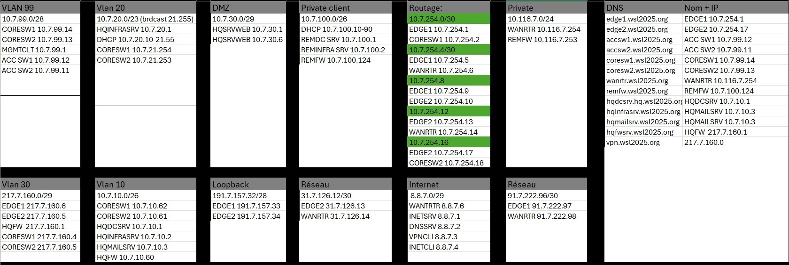

# 📡 SAÉ 5.01 - Concevoir, réaliser et présenter une solution technique

> **Infrastructure réseau complète** - Déploiement multi-sites (HQ, Remote, Internet)  
> IUT de Belfort-Montbéliard | Décembre 2025 | Groupe 7

---

## 🎯 Objectif du projet

Concevoir, déployer et présenter une **infrastructure réseau d'entreprise complète** comprenant :
- 3 sites interconnectés (HQ Lyon, Remote WSFR, Internet WorldSkills)
- Services systèmes (Active Directory, DNS, DHCP, Web, Mail)
- Sécurité avancée (PKI, Firewall, VPN)
- Automatisation (Ansible, playbooks Cisco)

**Durée :** 6 jours (08/12 - 15/12/2025)  
**Équipe :** 4 étudiants (1 Pilote Projet, 2 Cyber, 1 IoM)

---

## 📋 Architecture

### Sites déployés
| Site | Rôle | Connexion |
|------|------|-----------||
| **HQ** | Siège social (Lyon) | WAN privé + Internet |
| **Remote** | Site distant (WSFR) | Liaison MAN OSPF |
| **Internet** | Zone publique | BGP |

### Services déployés
- 🔐 **Sécurité** : PKI (Root CA + Sub CA), Firewall nftables, OpenVPN
- 🌐 **Réseau** : VLANs, HSRP/VRRP, OSPF, BGP, NAT
- 💻 **Système** : Active Directory, DNS/DNSSEC, DHCP Failover
- 📧 **Applicatif** : Web HA (Docker), Mail (SMTP/IMAP), Partages DFS
- ⚙️ **Automatisation** : Ansible (backup config, NTP, monitoring)

---

## 📂 Structure du dépôt

```
SA-5.01/
├── docs/                       # Documentation technique
│   ├── plan_adressage.md      # Plan d'adressage IP complet
│   ├── architecture.md        # Schémas L2/L3/Routing
│   └── guide_deployment.md    # Guide de déploiement
├── configs/                    # Fichiers de configuration
│   ├── switches/              # Configs Cisco (VLANs, STP, HSRP)
│   ├── routers/               # Configs routage (OSPF, BGP)
│   ├── servers/               # Configs serveurs (AD, DNS, etc.)
│   └── security/              # Configs firewall, VPN, PKI
├── ansible/                    # Playbooks Ansible
│   ├── inventory.yml          # Inventaire des équipements
│   ├── backup_config.yml      # Sauvegarde automatique
│   └── check_environment.yml  # Vérification état réseau
├── jalons/                     # Livrables gestion de projet
│   ├── jalon1_mindmap.pdf     # Carte heuristique
│   ├── jalon2_trello.md       # Lien Trello
│   ├── jalon3_gantt.pdf       # Planning Gantt
│   └── jalon4_dashboard.xlsx  # Dashboard suivi
└── README.md                   # Ce fichier
```

---

## 🚀 Jalons du projet

| Jalon | Livrable | Statut | Date |
|-------|----------|--------|------|
| **J1** | Mind Map (Carte heuristique) | ✅ Terminé | 08/12 |
| **J2** | Outil de gestion (Trello) | ✅ Terminé | 09/12 |
| **J3** | Planning Gantt | 🚧 En cours | 10/12 |
| **J4** | Dashboard configuration | ⏳ À faire | 11/12 |
| **J6** | Documentation technique | ⏳ À faire | 15/12 |
| **J8** | Soutenance finale | ⏳ À faire | 17/12 |

---

## 🛠️ Technologies utilisées

**Réseau :**
- Cisco IOS (Switches 3750, Routeurs)
- Protocoles : VLAN, STP, HSRP, OSPF, BGP
- VPN : OpenVPN

**Systèmes :**
- Windows Server 2022 (AD, DNS, DHCP, ADCS)
- Debian 12 (Services Linux, Root CA)
- Virtualisation : ESXi / Proxmox

**Automatisation :**
- Ansible (Playbooks réseau)
- Python (Scripts monitoring)

**Sécurité :**
- PKI (Root CA + Sub CA ADCS)
- Firewall nftables
- Certificats SSL/TLS

---

## 📊 Gestion de projet

**Méthodologie :** Agile / Scrum
- **Daily Scrum** : 2x/jour (matin + soir)
- **Outil de suivi** : Trello + Gantt TeamGantt
- **Dashboard** : Excel (suivi temps réel des serveurs)

**Responsabilités :**
- 🎯 **Pilote Projet** : Planning, coordination, jalons
- 🔒 **Cyber x2** : PKI, Firewall, VPN, Hardening
- ⚙️ **IoM** : Ansible, automatisation, monitoring

---

## 📸 Captures d'écran

### Plan d'adressage IP


### Architecture réseau
*(À ajouter : schémas L2/L3)*

---

## 📝 Comptes rendus

Les comptes rendus journaliers sont disponibles dans le dossier `/docs/cr_journaliers/` :
- [CR Jour 1 - 08/12](docs/cr_journaliers/J1_08-12.md)
- [CR Jour 2 - 09/12](docs/cr_journaliers/J2_09-12.md)
- *(à compléter chaque jour)*

---

## 🏆 Résultats attendus

✅ Infrastructure réseau multi-sites opérationnelle  
✅ Services systèmes hautement disponibles (AD, DNS, DHCP)  
✅ Sécurisation complète (PKI, VPN, Firewall)  
✅ Automatisation déployée (Ansible)  
✅ Documentation technique exhaustive  
✅ Soutenance réussie  

---

## 👥 Contributeurs

**Groupe 7 - IUT Belfort-Montbéliard**
- Hugo Coston ([@hugo0490](https://github.com/hugo0490)) - Pilote Projet
- Étudiant 2 - Cybersécurité
- Étudiant 3 - Cybersécurité
- Étudiant 4 - IoM

---

## 📜 Licence

Ce projet est réalisé dans le cadre de la **SAÉ 5.01** à l'IUT de Belfort-Montbéliard.  
© 2025 - Tous droits réservés.
